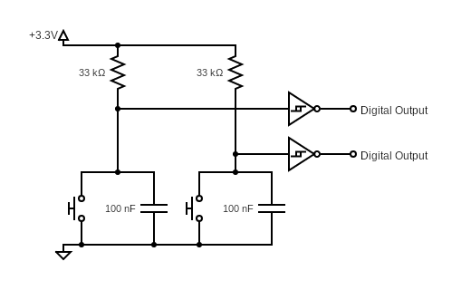

# Encoder Documentation

## Description

[EN12](https://www.ttelectronics.com/TTElectronics/media/ProductFiles/Datasheets/EN12.pdf) encoder to track distance covered and angle of robot

## Schematics

Here is the schematic:

## Electrical Layout

Manually soldered board, 10x24 pin layout

Components:
* 1x EN12-HN rotary encoder

Inputs:
* 1x GND 
* 1x V+ (3.3V)

Outputs:
* 2x digital outputs (1 per channel)
