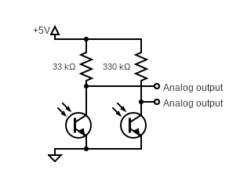

# Infrared Documentation

## Description

Supports 2x [QSD124](https://www.onsemi.com/pdf/datasheet/qsd123-d.pdf) infrared phototransistors and reads their values as analog inputs to the bluepill

## Schematics

Here is the schematic for the board (both sensors):

## PCB Layout

Manually soldered board, 10x24 pin layout (actual footprint of 10x10 pins)

Components:
* 2x 33kΩ resistors
* 2x QSD124 infrared phototransistors

Inputs:
* 1x GND 
* 1x V+ (5V)

Outputs:
* 2x analog outputs (1 per infrared sensor)
