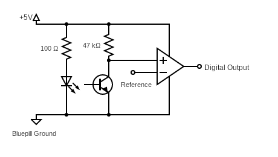

# Reflectance Sensors Documentation

## Description

Circuit board to support 3x TCRT500 reflectance sensors and read their outputs as digital values by using a comparator and a reference voltage

## Schematics

Here is the schematic for each reflectance sensor:

The LED and NPN transistor in the schematic are part of the TCRT500 reflectance sensor and come as a single package. The output of the reflectance sensor feeds into a comparator to compare against a reference voltage on the inverting input.

The reference voltage is generated by the bluepill, explained through the following schematic

Using a PWM output on the Bluepill and a low pass filter, we can generate a pretty consistent DC voltage to use as the reference input into the inverting input of the comparator

## PCB Layout

Manually soldered board, 10x24 pin layout

Components:
* 2x LM393-N dual comparators
* 1x LM358AN dual operational amplifier (op amp)
* 3x TCRT500 Reflectance Sensors
* 4x 47kΩ resistors
* 3x 100Ω resistors
* 1x 470nF capacitor

Inputs:
* 1x GND 
* 1x V+ (5V)
* 1x PWM pin (used as reference voltage)

Outputs:
* 3x digital outputs (1 per reflectance sensor)
